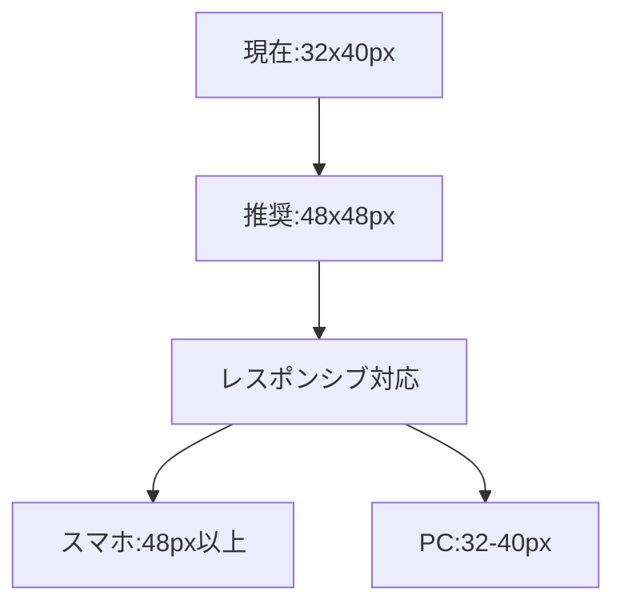

# モバイルUI改善計画書

## 1. 現在の問題点
- スマホで記号が選択しにくい
- タッチターゲットが小さい（32x40px）
- 記号選択UIがPCサイドバーのみ
- タッチイベントの処理不足

## 2. 改善目標
✅ タッチ操作の最適化  
✅ レスポンシブなUI設計  
✅ 直感的な記号選択  

## 3. 実装計画

### 3.1 タッチターゲットの拡大


### 3.2 記号選択UIの改善
```typescript
// MobileSymbolPalette.tsx
const MobileSymbolPalette = () => {
  return (
    <div className="fixed bottom-4 right-4 md:hidden">
      <!-- フローティングボタン -->
    </div>
  );
};
```

### 3.3 実装ステップ
1. レスポンシブセルサイズの導入
2. モバイル用記号パレットの作成
3. タッチイベントの追加
4. ビジュアルフィードバックの改善

## 4. 優先順位

| 優先度 | 機能 | 見積もり |
|--------|------|----------|
| 高 | タッチターゲット拡大 | 1h |
| 高 | 基本フローティングパレット | 3h |
| 中 | カテゴリ分類 | +2h |
| 低 | 検索機能 | +3h |

## 5. 将来の拡張案
- ジェスチャー操作（ピンチズームなど）
- カスタム記号作成機能
- テーマカスタマイズ